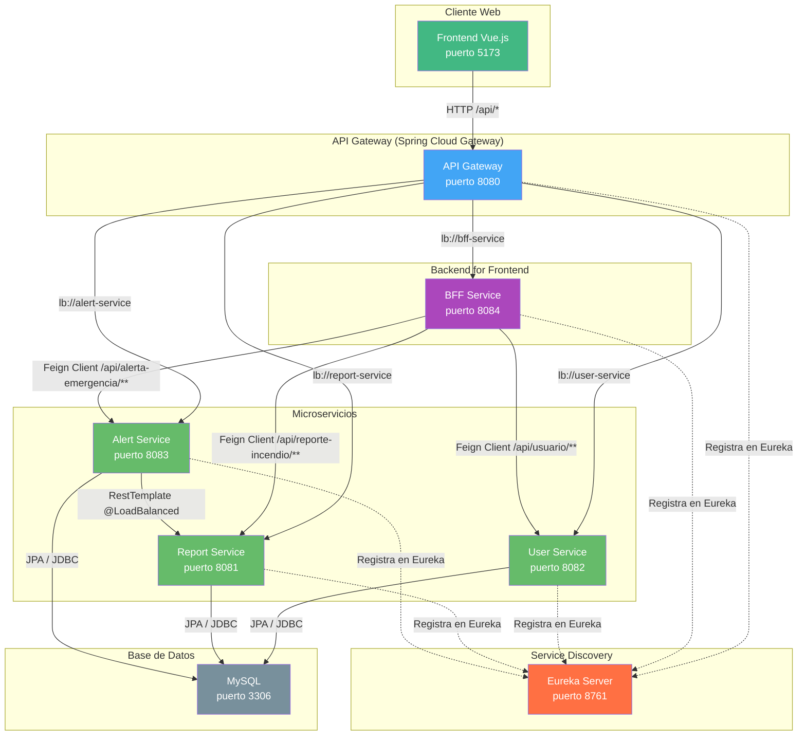

# Diagrama de Arquitectura - Fullstack3




## Flujo de una solicitud

```
Frontend (5173) → GET /api/bff/dashboard/estadisticas
    ↓
API Gateway (8080) → reconoce ruta /api/bff/**
    ↓ lb://bff-service
BFF Service (8084) → llama a ReportClient.getAllReportes()
    ↓ Feign Client (Eureka descubre report-service)
Report Service (8081) → consulta MySQL, devuelve datos
    ↓
BFF → procesa estadísticas (cuenta por estado)
    ↓
API Gateway → devuelve respuesta al Frontend
```

## Cobertura de Tests

| Servicio | Tests | Cobertura línea |
|---|---|---|
| User Service | 25 | ~95% |
| Report Service | 17 | ~97% |
| Alert Service | 22 | ~83% |
| BFF | 9 | ~98% |
| API Gateway | 1 | N/A |
| Eureka Server | 1 | N/A |
| Frontend (Vitest) | 20 | N/A |
