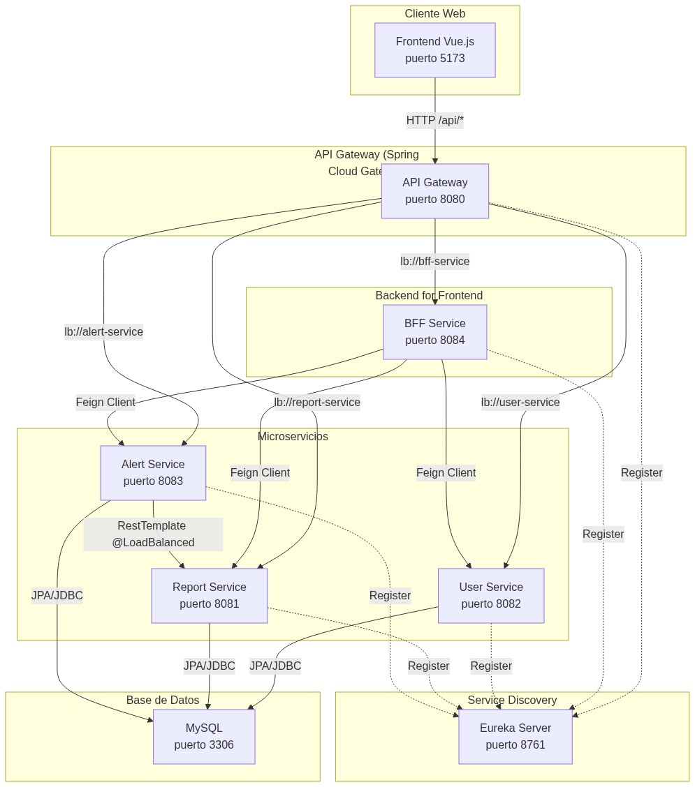

# Fullstack3 - Eureka Server

Servicio de Service Discovery para el sistema de gestión de emergencias **Valle del Sol**. Permite que los microservicios se descubran entre sí sin necesidad de IPs o puertos fijos.

## Requisitos

- Java 17
- Maven (incluye wrapper `mvnw.cmd`)

## Cómo levantar

```bash
# Opción 1: Local
mvnw spring-boot:run

# Opción 2: Docker
docker build -t eureka-server .
docker run -p 8761:8761 eureka-server
```

Eureka Dashboard disponible en: http://localhost:8761

## Orden de levantamiento recomendado

1. **Eureka Server** (puerto 8761) — este servicio
2. MySQL (puerto 3306)
3. user-service, report-service, alert-service (se registran en Eureka)
4. bff-service (puerto 8084)
5. api-gateway (puerto 8080) — punto de entrada para el frontend
6. frontend (puerto 80)

## Configuración

| Propiedad | Descripción |
|---|---|
| `server.port=8761` | Puerto del servidor |
| `eureka.client.register-with-eureka=false` | No se registra a sí mismo |
| `eureka.client.fetch-registry=false` | No consulta su propio registro |

## Diagrama de Arquitectura



Para ver el diagrama completo con detalles del flujo, abre [ARCHITECTURE.md](ARCHITECTURE.md).

## Servicios registrados

| Servicio | Nombre Eureka | Puerto |
|---|---|---|
| User Service | `user-service` | 8082 |
| Report Service | `report-service` | 8081 |
| Alert Service | `alert-service` | 8083 |
| BFF | `bff-service` | 8084 |
| API Gateway | `api-gateway` | 8080 |
